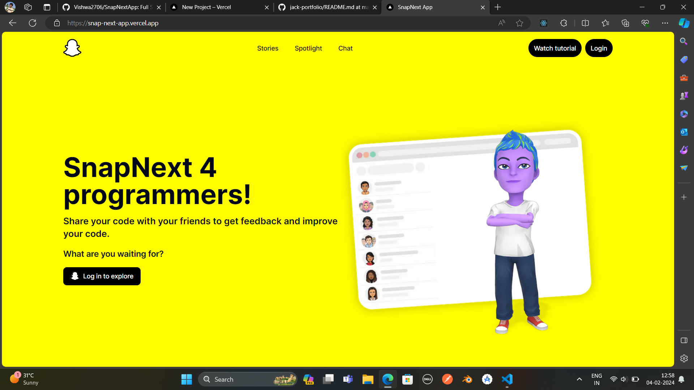
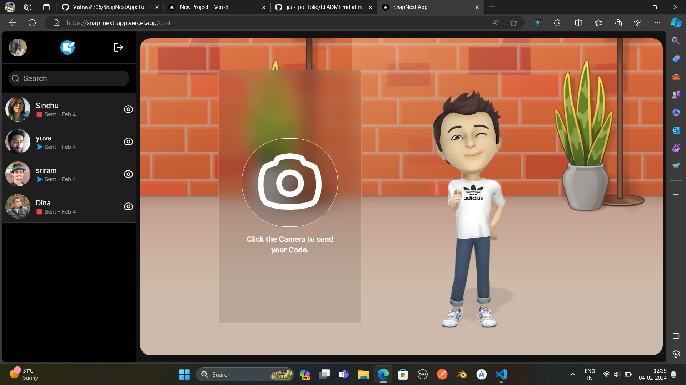
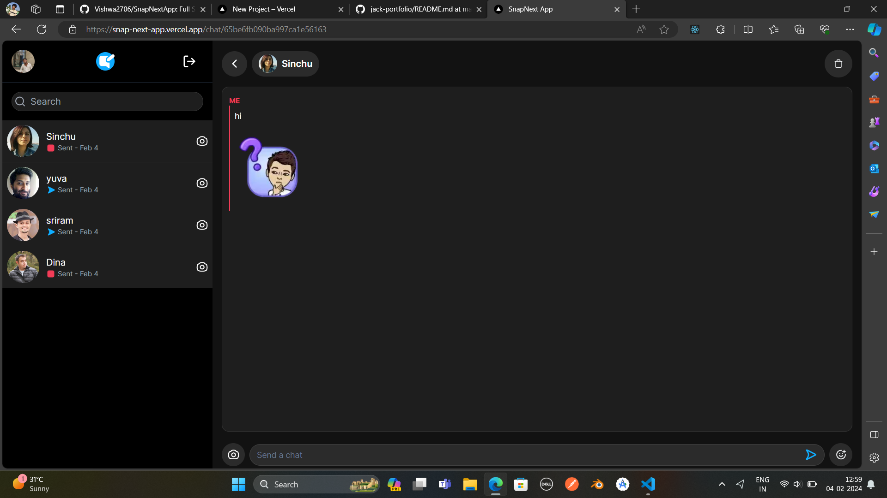

<h1>SnapNext App Description:</h1>

Overview:
SnapNext is a cutting-edge web application built on the latest web technologies, offering a seamless and responsive user experience. Leveraging Next.js 14, TypeScript, MongoDB, Tailwind CSS, and Shadcn, the app combines robust functionality with a modern design aesthetic.

Key Features:

Next.js 14:

Utilizing the power of Next.js 14, SnapNext ensures optimal performance and SEO-friendly web pages. Server-side rendering and advanced features of Next.js contribute to a fast and smooth user experience.
TypeScript (ts):

The app employs TypeScript to enhance code maintainability and provide static typing, catching potential errors during development. This results in more reliable and scalable code.
MongoDB Integration:

SnapNext seamlessly integrates with MongoDB, a NoSQL database, to handle data storage efficiently. This allows for flexible and scalable data management, crucial for dynamic and evolving applications.
Tailwind CSS:

Tailwind CSS is employed for styling, offering a utility-first approach. SnapNext's UI is not only visually appealing but also responsive across various screen sizes, ensuring a consistent and enjoyable user experience.
Shadcn:

(Assuming "Shadcn" is a library or component) - Shadcn is integrated to enhance the app's visual aesthetics or provide specific UI/UX functionalities. This library complements the design and user interaction aspects of SnapNext.
Technical Stack:

Frontend:

Next.js 14
TypeScript
Tailwind CSS
Shadcn (if applicable)
Backend:

MongoDB
Why SnapNext?

SnapNext stands out as a modern, feature-rich application that combines the latest web technologies for a robust and visually appealing user experience. Whether you're browsing on desktop or mobile, SnapNext adapts seamlessly to deliver content quickly and efficiently.


This is a [Next.js](https://nextjs.org/) project bootstrapped with [`create-next-app`](https://github.com/vercel/next.js/tree/canary/packages/create-next-app).

## Getting Started

First, run the development server:

```bash
npm run dev
# or
yarn dev
# or
pnpm dev
# or
bun dev
```

Open [http://localhost:3000](http://localhost:3000) with your browser to see the result.

You can start editing the page by modifying `app/page.tsx`. The page auto-updates as you edit the file.

This project uses [`next/font`](https://nextjs.org/docs/basic-features/font-optimization) to automatically optimize and load Inter, a custom Google Font.

## Learn More

To learn more about Next.js, take a look at the following resources:

- [Next.js Documentation](https://nextjs.org/docs) - learn about Next.js features and API.
- [Learn Next.js](https://nextjs.org/learn) - an interactive Next.js tutorial.

You can check out [the Next.js GitHub repository](https://github.com/vercel/next.js/) - your feedback and contributions are welcome!

## Deploy on Vercel

The easiest way to deploy your Next.js app is to use the [Vercel Platform](https://vercel.com/new?utm_medium=default-template&filter=next.js&utm_source=create-next-app&utm_campaign=create-next-app-readme) from the creators of Next.js.

Check out our [Next.js deployment documentation](https://nextjs.org/docs/deployment) for more details.
